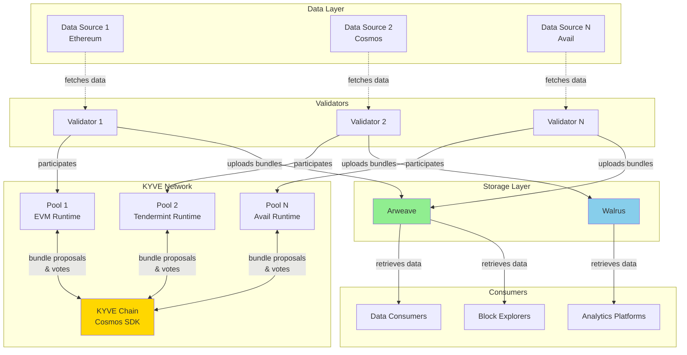
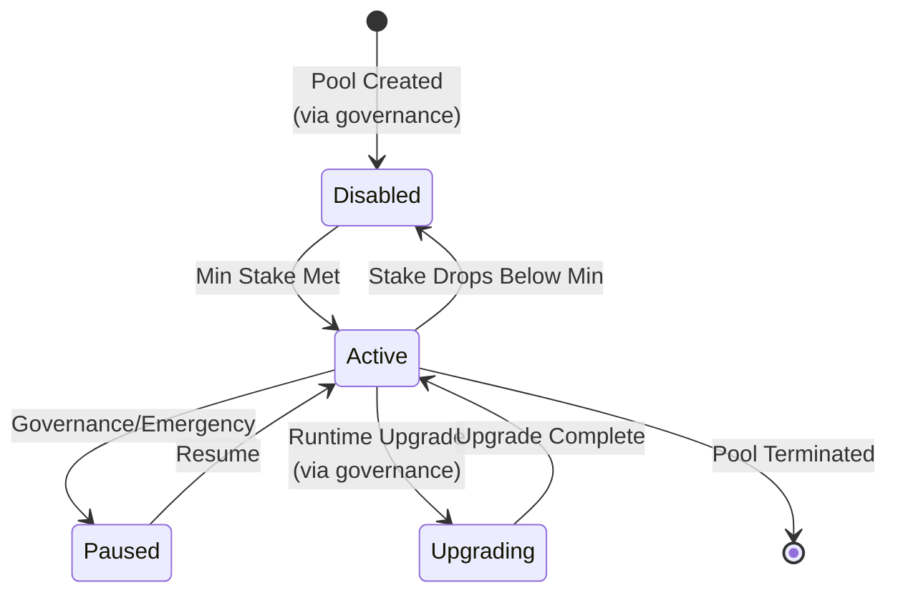
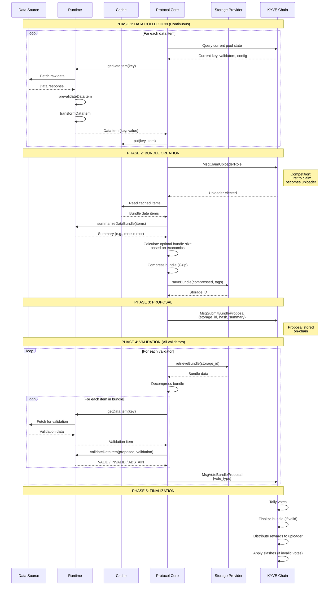
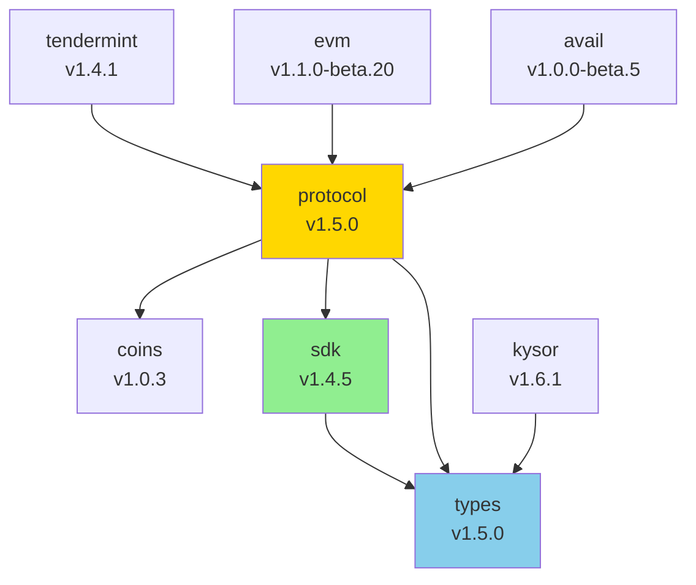

# KYVE Protocol Architecture

This document provides a comprehensive overview of the KYVE protocol implementation in TypeScript, including system design, core components, data flows, and architectural patterns.

## Table of Contents

1. [Overview](#overview)
2. [System Architecture](#system-architecture)
3. [Core Components](#core-components)
4. [Data Flow](#data-flow)
5. [Package Architecture](#package-architecture)
6. [Plugin System](#plugin-system)
7. [Network Communication](#network-communication)
8. [Economic Model](#economic-model)
9. [Security Model](#security-model)
10. [Design Principles](#design-principles)

## Overview

KYVE is a decentralized data validation and archival protocol built on Cosmos SDK. The protocol enables trustless archival of arbitrary data sources to permanent storage providers like Arweave and Walrus, with cryptographic proof of data validity through validator consensus.

### Key Characteristics

- **Modular**: Runtime-based architecture supports any data source
- **Trustless**: Multi-validator consensus on data validity
- **Permanent**: Stores validated data on permanent storage (Arweave, Walrus)
- **Scalable**: Horizontal scaling through multiple independent pools
- **Economic**: Incentive-aligned validator rewards and slashing
- **Deterministic**: All validation logic produces consistent results across validators

### High-Level Architecture



## System Architecture

### Three-Layer Architecture

#### 1. Data Source Layer

- External data providers (blockchains, APIs, databases)
- Accessed by validators through runtime-specific logic
- No trust assumption required on data sources
- Can be centralized or decentralized
- Examples: Ethereum nodes, Cosmos nodes, Avail nodes

#### 2. Validation Layer (KYVE Network)

**Storage Pools**: Independent data validation units
- Each pool validates one specific data source
- Configured with a runtime, storage provider, and economic parameters
- Operates independently from other pools

**Validators**: Run protocol nodes that fetch, validate, and archive data
- Download runtime binaries
- Fetch data from sources
- Create and upload bundles
- Vote on other validators' bundles
- Stake tokens as collateral

**KYVE Chain**: Cosmos SDK blockchain for consensus, governance, and economics
- Coordinates validator participation
- Records bundle proposals and votes
- Distributes rewards and applies slashes
- Manages protocol parameters via governance

#### 3. Storage Layer

**Permanent Storage**: Arweave, Walrus, etc.
- Immutable storage of validated data bundles
- Decentralized and censorship-resistant
- Pay-once, store-forever model (Arweave)

**Temporary Cache**: Local validator cache for in-progress bundles
- Fast access for data collection
- Cleared after bundle finalization

**On-Chain Metadata**: Bundle references and validation proofs
- Storage IDs pointing to bundles
- Merkle roots for bundle verification
- Vote records for accountability

## Core Components

### 1. Storage Pool

A pool is an independent validation unit for a specific data source.

**Properties:**
- **Runtime**: Defines how to fetch and validate data (e.g., `@kyvejs/evm`)
- **Config**: Runtime-specific configuration (RPC endpoints, etc.)
- **Storage Provider**: Where bundles are stored (Arweave, Walrus)
- **Compression**: Bundle compression algorithm (Gzip, No Compression)
- **Economics**: Operating costs, upload interval, max bundle size
- **Governance**: Pool creation and updates via governance proposals

**Lifecycle:**



### 2. Protocol Validator (Node Operator)

Validators run protocol nodes that perform the core validation work.

**Components:**
```
Protocol Node = Validator Class + Runtime + Storage Provider + Cache + KYVE Chain Client
```

**Responsibilities:**
- Fetch data from source using runtime
- Validate data deterministically
- Create and propose bundles when elected uploader
- Vote on other validators' bundles
- Upload bundles to storage provider
- Maintain economic stake in pools

**Requirements:**
- Run data source node (e.g., Ethereum node for EVM pools)
- Run KYVE protocol node (runtime binary)
- Stake minimum delegation amount
- Maintain sufficient balance for:
  - Storage costs (uploaded to Arweave/Walrus)
  - Network fees (KYVE chain transactions)
  - Collateral (slashing risk)

### 3. Validator Class (@kyvejs/protocol)

The core orchestrator for all protocol operations.

**Key Properties:**
```typescript
class Validator {
  runtime: IRuntime;                    // Pluggable data source logic
  cacheProvider: ICacheProvider;        // Local storage
  sdk: KyveSDK[];                       // Blockchain clients (with fallback)
  client: KyveClient[];                 // Transaction methods
  lcd: KyveLCDClientType[];             // Query clients
  pool: PoolResponse;                   // Current pool state
  logger: Logger;                       // Structured logging
  metrics: IMetrics;                    // Prometheus metrics
}
```

**Key Methods:**
```typescript
// Lifecycle
run(): void                            // Main entry point

// Data Collection Thread
runCache(): void                       // Continuous data pre-fetching
saveDataItem(item: DataItem): void     // Cache data locally

// Validation Thread
runNode(): void                        // Main validation loop
claimUploaderRole(): void              // Compete to be uploader
createBundleProposal(): void           // Create and upload bundle
validateBundleProposal(): void         // Validate others' bundles
voteBundleProposal(vote: VoteType): void // Submit vote

// Economic
isBalanceSufficient(): boolean         // Check if can afford operations
calculateBundleReward(): string        // Expected reward calculation

// Storage
uploadBundle(data: Buffer): string     // Upload to storage provider
downloadBundle(id: string): Buffer     // Download from storage
```

### 4. Runtime Interface (IRuntime)

Runtimes implement custom data collection and validation logic.

**Interface:**
```typescript
interface IRuntime {
  name: string;      // Runtime identifier (e.g., "@kyvejs/evm")
  version: string;   // Semantic version
  config: any;       // Runtime-specific configuration

  // Lifecycle
  validateSetConfig(rawConfig: string): Promise<void>;

  // Data Collection
  getDataItem(v: Validator, key: string): Promise<DataItem>;
  prevalidateDataItem(v: Validator, item: DataItem): Promise<boolean>;
  transformDataItem(v: Validator, item: DataItem): Promise<DataItem>;

  // Validation
  validateDataItem(
    v: Validator,
    proposedItem: DataItem,
    validationItem: DataItem
  ): Promise<VoteType>; // VALID, INVALID, ABSTAIN

  // Bundle Management
  summarizeDataBundle(v: Validator, bundle: DataItem[]): Promise<string>;
  nextKey(v: Validator, key: string): Promise<string>;
}
```

**Available Runtimes:**
- `@kyvejs/tendermint` - Tendermint/CometBFT chains (blocks)
- `@kyvejs/tendermint-ssync` - Tendermint state sync snapshots
- `@kyvejs/tendermint-bsync` - Tendermint block sync
- `@kyvejs/evm` - EVM-compatible chains (blocks + receipts)
- `@kyvejs/avail` - Avail data availability blocks
- `@kyvejs/ethereum-blobs` - Ethereum EIP-4844 blobs

### 5. Storage Provider Interface (IStorageProvider)

Storage providers handle permanent data archival.

**Interface:**
```typescript
interface IStorageProvider {
  name: string;           // Provider identifier
  coinDecimals: number;   // Token decimals for pricing

  getAddress(): Promise<string>;
  getBalance(): Promise<string>;
  getPrice(bytes: number): Promise<string>;

  saveBundle(bundle: Buffer, tags: BundleTag[]): Promise<StorageReceipt>;
  retrieveBundle(storageId: string, timeout: number): Promise<StorageReceipt>;
}
```

**Available Providers:**
- **Arweave** - Permanent storage on Arweave network
- **Walrus** - Sui-based decentralized storage
- **TurboStorage** - Arweave upload service (efficient)
- **IrysStorage** - Bundled uploads to Arweave
- **Kwil** - SQL database storage
- **Load** - Testing/development provider

### 6. Cache Provider Interface (ICacheProvider)

Local key-value store for in-progress validation.

**Interface:**
```typescript
interface ICacheProvider {
  name: string;
  path: string;

  init(path: string): Promise<void>;
  put(key: string, value: DataItem): Promise<void>;
  get(key: string): Promise<DataItem>;
  exists(key: string): Promise<boolean>;
  del(key: string): Promise<void>;
  drop(): Promise<void>;
}
```

**Purpose:**
- Store fetched data items locally
- Enable fast bundle assembly
- Survive runtime restarts
- Allow retry logic

## Data Flow

### Complete Bundle Lifecycle



### Upload Flow (Detailed)

When a validator is elected uploader:

1. **Claim Uploader Role**
   - Transaction: `MsgClaimUploaderRole`
   - First validator to successfully claim becomes uploader
   - Validator stakes reputation on producing valid bundle

2. **Read from Cache**
   - Load all cached items from `from_key` to current height
   - Calculate optimal bundle size based on:
     - Expected rewards (operating cost + storage reward + delegator reward)
     - Storage costs (per-byte price * bundle size)
     - Network fees (transaction costs)
     - Pool's max bundle size limit

3. **Summarize Bundle**
   - Runtime creates compact summary (typically merkle root)
   - Summary stored on-chain (<100 characters)
   - Used for quick verification without downloading full bundle

4. **Compress Bundle**
   - Apply pool's compression algorithm (usually Gzip)
   - Typically achieves ~70% size reduction
   - Reduces storage costs significantly

5. **Upload to Storage**
   - Pay storage costs from validator's storage wallet
   - Receive storage ID (e.g., Arweave transaction ID)
   - Storage is permanent and immutable

6. **Submit Proposal**
   - Transaction: `MsgSubmitBundleProposal`
   - Includes: storage ID, data hash, bundle summary, metadata
   - Marks validator as having completed uploader duty

7. **Wait for Validation**
   - Other validators download and validate
   - If valid: receive bundle reward + keep stake
   - If invalid: lose stake (slashed) + no reward

### Validation Flow (Detailed)

When a validator validates another's proposal:

1. **Download Bundle**
   - Fetch from storage provider using storage ID
   - Verify data hash matches proposal
   - Handle storage provider failures gracefully

2. **Decompress Bundle**
   - Apply decompression algorithm
   - Verify decompressed data integrity

3. **Validate Metadata**
   - Check from_key, to_key match expected values
   - Verify bundle_size equals actual item count
   - Validate bundle summary format

4. **Validate Each Item**
   - For each item in bundle:
     - Fetch fresh data from source via runtime
     - Call runtime's `validateDataItem`
     - Runtime returns VALID, INVALID, or ABSTAIN
   - Handle non-deterministic data appropriately

5. **Aggregate Vote**
   - If all items VALID → vote VALID
   - If any item INVALID → vote INVALID
   - If any item ABSTAIN and rest VALID → vote ABSTAIN
   - If cannot determine → vote ABSTAIN (safe default)

6. **Submit Vote**
   - Transaction: `MsgVoteBundleProposal`
   - Vote is recorded on-chain
   - If vote contradicts finalized result: receive slash

## Package Architecture

### Monorepo Structure

```
kyvejs/
├── common/                 # Shared packages
│   ├── protocol/           # Core protocol validator
│   ├── sdk/                # KYVE blockchain SDK
│   ├── types/              # Generated TypeScript types
│   └── coins/              # Coin arithmetic utilities
├── integrations/           # Runtime implementations
│   ├── tendermint/
│   ├── tendermint-ssync/
│   ├── tendermint-bsync/
│   ├── evm/
│   ├── avail/
│   └── ethereum-blobs/
└── tools/                  # Auxiliary tools
    └── kysor/              # Protocol node manager
```

### Package Dependencies



### Common Packages

#### @kyvejs/protocol
- **Purpose**: Core validator implementation
- **Key Classes**: `Validator`
- **Key Methods**: `run()`, `runCache()`, `runNode()`, `createBundleProposal()`, `validateBundleProposal()`
- **Dependencies**: `@kyvejs/sdk`, `@kyvejs/types`, `@kyvejs/coins`
- **Size**: ~5,000 lines of TypeScript

#### @kyvejs/sdk
- **Purpose**: KYVE blockchain interaction
- **Features**: Transaction signing, queries, multi-wallet support
- **Wallets**: Mnemonic, Private Key, Keplr, Cosmostation, Leap
- **Dependencies**: `@kyvejs/types`, CosmJS
- **Networks**: Mainnet, Testnet (kaon-1), Devnet (korellia-2), Local

#### @kyvejs/types
- **Purpose**: TypeScript type definitions
- **Source**: Generated from Protocol Buffers
- **Modules**: All KYVE and Cosmos SDK modules
- **Structure**: `lcd/` (queries) and `client/` (transactions)

#### @kyvejs/coins
- **Purpose**: Coin arithmetic (similar to sdk.Coins in Go)
- **Methods**: `add()`, `sub()`, `mul()`, `div()`, comparison methods
- **Features**: Handles multi-denomination calculations

### Integration Packages

Each integration is a standalone runtime implementation:

**Structure:**
```
integration/
├── src/
│   ├── index.ts         # Entry point (bootstraps Validator)
│   └── runtime.ts       # IRuntime implementation
├── utils/               # Helper functions (merkle, schemas, etc.)
├── package.json         # Dependencies and build scripts
└── README.md            # Documentation
```

**Build Output:**
- `dist/` - TypeScript compiled to ESM
- `dist-cjs/` - Bundled CommonJS for binary compilation
- `out/` - Final binaries for Linux/macOS (x64/arm64)

**Build Process:**
```bash
yarn build          # TypeScript → ESM
yarn transpile      # ESM → CommonJS bundle
yarn build:binaries # CommonJS → Platform binaries
```

### Tools

#### KYSOR
- **Purpose**: Protocol node process manager (like Cosmovisor)
- **Features**:
  - Auto-downloads runtime binaries from chain
  - Manages multiple valaccounts (one per pool)
  - Handles runtime upgrades automatically
  - Provides metrics endpoint for monitoring
  - Systemd integration support

**KYSOR Architecture:**
```
KYSOR Process
  ├── Valaccount 1 (Pool A) → Runtime Binary v1.2.0
  ├── Valaccount 2 (Pool B) → Runtime Binary v1.3.0
  └── Valaccount 3 (Pool C) → Runtime Binary v1.1.0
```

## Plugin System

### Runtime Plugin Architecture

Runtimes are plugins that implement the `IRuntime` interface.

**Example Runtime Structure:**

```typescript
// src/runtime.ts
export default class MyRuntime implements IRuntime {
  name = "@kyvejs/my-runtime";
  version = "1.0.0";
  config: MyConfig;

  async validateSetConfig(rawConfig: string): Promise<void> {
    this.config = JSON.parse(rawConfig);
    // Validate config
  }

  async getDataItem(v: Validator, key: string): Promise<DataItem> {
    // Fetch data from source
    const data = await fetchFromSource(key);
    return { key, value: data };
  }

  async validateDataItem(
    v: Validator,
    proposedItem: DataItem,
    validationItem: DataItem
  ): Promise<number> {
    // Deterministic comparison
    if (JSON.stringify(proposedItem.value) === JSON.stringify(validationItem.value)) {
      return VOTE.VOTE_TYPE_VALID;
    }
    return VOTE.VOTE_TYPE_INVALID;
  }

  // ... other required methods
}

// src/index.ts
import { Validator } from "@kyvejs/protocol";
import MyRuntime from "./runtime";

new Validator(new MyRuntime()).bootstrap();
```

### Storage Provider Plugins

Custom storage providers can be added by implementing `IStorageProvider`:

```typescript
export class MyStorage implements IStorageProvider {
  name = "my-storage";
  coinDecimals = 9;

  async saveBundle(bundle: Buffer, tags: BundleTag[]): Promise<StorageReceipt> {
    const id = await this.upload(bundle, tags);
    return { storageId: id, storageData: bundle };
  }

  async retrieveBundle(storageId: string, timeout: number): Promise<StorageReceipt> {
    const data = await this.download(storageId, timeout);
    return { storageId, storageData: data };
  }

  // ... other required methods
}
```

## Network Communication

### KYVE Chain Interaction

**Endpoints:**
- **Tendermint RPC**: `:26657` - Block queries, transaction broadcasting
- **REST API**: `:1317` - LCD queries, account info
- **gRPC**: `:9090` - Direct protobuf queries

**Key Transactions:**
```typescript
// Bundle Operations
MsgClaimUploaderRole      // Compete to become bundle uploader
MsgSubmitBundleProposal   // Upload bundle and propose
MsgVoteBundleProposal     // Vote on bundle validity
MsgSkipUploaderRole       // Skip turn if cannot upload

// Staker Operations
MsgCreateStaker           // Register as protocol validator
MsgUpdateMetadata         // Update validator info
MsgJoinPool               // Join a specific pool
MsgLeavePool              // Leave a pool

// Delegation Operations
MsgDelegate               // Delegate to a staker
MsgWithdrawRewards        // Withdraw accumulated rewards
MsgUndelegate             // Undelegate from a staker
```

**Key Queries:**
```typescript
// Pool State
QueryPool                 // Get single pool info
QueryPools                // List all pools
QueryCanValidate          // Check if can participate
QueryCanPropose           // Check if eligible to upload

// Staker Info
QueryStaker               // Get staker details
QueryStakers              // List all stakers

// Bundle History
QueryFinalizedBundle      // Get finalized bundle
QueryBundlesQuery         // Query bundle history
```

### Storage Provider Communication

**Arweave:**
- **Upload**: POST to Turbo/Irys bundler node
- **Download**: GET from `https://arweave.net/<tx_id>`
- **Pricing**: Query network info for AR price per byte

**Walrus:**
- **Upload**: PUT to Walrus aggregator nodes
- **Download**: GET from Walrus network
- **Pricing**: Based on Sui storage costs

## Economic Model

### Validator Economics

**Revenue Streams:**
1. **Bundle Rewards**: Operating cost per bundle (when uploader)
2. **Network Inflation**: Proportional to stake (from KYVE chain staking)
3. **Delegation Commissions**: Percentage fee on delegator rewards

**Costs:**
1. **Storage Costs**: Pay for permanent storage uploads (Arweave/Walrus)
2. **Infrastructure**: Hardware, bandwidth, RPC node access
3. **Stake Opportunity Cost**: Capital locked in protocol
4. **Network Fees**: Transaction costs on KYVE chain

**Slashing Conditions:**
1. **Timeout Slash**: Fail to upload/vote within time limit (~5% stake)
2. **Vote Slash**: Vote contradicts finalized result (~10% stake)
3. **Upload Slash**: Upload invalid bundle (~20% stake)

### Bundle Reward Calculation

The protocol calculates expected rewards to ensure validators are profitable:

```
Bundle Reward = Operating Cost + Storage Reward + Delegator Reward - Network Fee

Where:
- Operating Cost: Fixed per bundle (set by pool)
- Storage Reward: Cover storage provider costs
- Delegator Reward: Incentivize delegations
- Network Fee: KYVE chain transaction costs
```

Validators only upload if: `Expected Reward > Storage Cost + Network Fee`

### Optimal Bundle Size

Validators optimize bundle size for profitability using binary search:

```typescript
function calculateOptimalBundleSize(
  storagePricePerByte: number,
  operatingCost: number,
  maxBundleSize: number,
  cachedItems: number
): number {
  let left = 1;
  let right = Math.min(maxBundleSize, cachedItems);

  while (left < right) {
    const mid = Math.floor((left + right + 1) / 2);
    const storageCost = mid * itemSize * storagePricePerByte;
    const expectedReward = operatingCost + storageCost;

    if (expectedReward > storageCost) {
      left = mid; // Can afford larger bundle
    } else {
      right = mid - 1; // Bundle too expensive
    }
  }

  return left;
}
```

This ensures validators never upload at a loss.

## Security Model

### Threat Model

**Trusted:**
- KYVE chain consensus (Cosmos SDK validators)
- Cryptographic primitives (SHA-256, Secp256k1)
- Storage provider immutability (Arweave permanence)

**Untrusted:**
- Data sources (any validator-operated source can be malicious)
- Protocol validators (byzantine fault tolerance assumed)
- Network layer (DDoS, censorship attempts possible)

### Security Guarantees

**Data Integrity:**
- SHA-256 hashes for all data items
- Merkle proofs for bundle contents
- Multi-validator consensus on validity (BFT)

**Availability:**
- Permanent storage on Arweave/Walrus
- Multiple storage provider options
- Decentralized validator set

**Censorship Resistance:**
- Permissionless validator participation (with minimum stake)
- Multiple storage providers
- Decentralized governance

### Attack Vectors & Mitigations

**1. Invalid Data Injection**
- **Attack**: Malicious uploader proposes invalid data
- **Mitigation**: Majority validators must validate independently
- **Punishment**: Uploader slashed if bundle finalized as invalid

**2. Validation Bypass**
- **Attack**: Colluding validators approve invalid data
- **Mitigation**: Requires >66% validator stake collusion (BFT threshold)
- **Punishment**: All colluding validators slashed

**3. Storage Censorship**
- **Attack**: Storage provider refuses to serve data
- **Mitigation**: Multiple storage provider implementations
- **Mitigation**: IPFS/HTTP gateway redundancy for Arweave

**4. Eclipse Attack**
- **Attack**: Isolate validator from correct data source
- **Mitigation**: Validators run own data source nodes
- **Mitigation**: ABSTAIN vote for uncertain data

## Design Principles

### 1. Determinism

All runtime validation must be deterministic across validators.

**Requirements:**
- Same input → same output (always)
- No randomness or timestamps (unless from data source)
- Consistent JSON serialization
- Handle non-deterministic fields explicitly (ABSTAIN vote)

**Example (EVM runtime):**
```typescript
// Remove non-deterministic field
delete transaction.confirmations;

// Use consistent comparison
if (JSON.stringify(proposed) === JSON.stringify(validated)) {
  return VOTE.VOTE_TYPE_VALID;
}
```

### 2. Modularity

Components are loosely coupled via interfaces.

**Benefits:**
- Easy to add new runtimes (just implement IRuntime)
- Swap storage providers without code changes
- Replace cache implementations
- Test components independently
- Independent package versioning

### 3. Economic Alignment

Incentives align with desired behavior.

**Principles:**
- Reward correct validation (bundle rewards)
- Punish incorrect validation (slashing)
- Cover validator costs (storage rewards)
- Encourage competition (uploader selection)
- Enable passive income (delegation rewards)

### 4. Fail-Safe Design

System degrades gracefully under failures.

**Examples:**
- ABSTAIN vote for uncertain data (safe default)
- Skip uploader if can't produce bundle (no penalty)
- Timeout protection against hung validators
- Retry logic for network failures
- Multiple RPC endpoints with fallback

## Monitoring & Observability

### Metrics

Protocol nodes expose Prometheus metrics on `:8080/metrics`:

```
# Validator Metrics
kyve_validator_balance                # Current balance
kyve_validator_stake                  # Staked amount
kyve_validator_delegations            # Delegation count

# Pool Metrics
kyve_pool_bundle_height               # Current bundle height
kyve_pool_bundle_count                # Total bundles uploaded
kyve_pool_upload_success_rate         # Success percentage

# Performance Metrics
kyve_data_fetch_duration_seconds      # Time to fetch data
kyve_validation_duration_seconds      # Time to validate
kyve_storage_upload_duration_seconds  # Time to upload

# Economic Metrics
kyve_storage_cost_ukyve               # Storage cost per bundle
kyve_bundle_reward_ukyve              # Reward per bundle
kyve_net_profit_ukyve                 # Profit per bundle
```

### Logging

Structured logging with multiple levels:

```typescript
v.logger.info('Fetching data item', { key, pool_id });
v.logger.warn('Finality not reached', { current_height, finality });
v.logger.error('Validation failed', { error, item_key });
v.logger.debug('Cache hit', { key, size });
```

Log levels: `fatal`, `error`, `warn`, `info`, `debug`, `trace`

## Additional Resources

- [Protocol Package README](common/protocol/README.md)
- [SDK Package README](common/sdk/README.md)
- [Types Package README](common/types/README.md)
- [KYSOR README](tools/kysor/README.md)
- [Contributing Guide](CONTRIBUTING.md)
- [Development Guide](DEVELOPMENT.md)
- [KYVE Documentation](https://docs.kyve.network/)
- [Cosmos SDK Documentation](https://docs.cosmos.network/)
