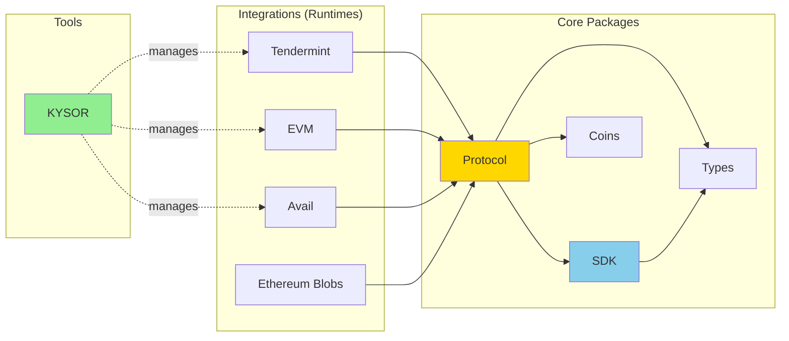

<div align="center">
  <h1>@kyvejs</h1>
</div>


<p align="center">
<strong>Tools for building applications on KYVE</strong>
</p>

<br/>

<div align="center">
  

  

  

  
</div>

<div align="center">
  <a href="https://twitter.com/KYVENetwork" target="_blank">
    
  </a>
  <a href="https://discord.com/invite/kyve" target="_blank">
    
  </a>
  <a href="https://t.me/kyvenet" target="_blank">
    
  </a>
</div>

<br/>

KYVE, the Web3 data lake solution, is a protocol that enables data providers to standardize, validate, and permanently store blockchain data streams. By leveraging permanent data storage solutions like Arweave, KYVE’s Cosmos SDK chain creates permanent backups and ensures the scalability, immutability, and availability of these resources over time.

## Project Overview

**Common:**

- [@kyvejs/types](common/types/README.md) - holds all types for the KYVE application in typescript
- [@kyvejs/sdk](common/sdk/README.md) - development kit for communicating with the KYVE blockchain
- [@kyvejs/protocol](common/protocol/README.md) - core functionality for running validators on the KYVE network

**Tools:**

- [@kyvejs/kysor](tools/kysor/README.md) - The Cosmovisor of KYVE

**Integrations:**

- [@kyvejs/tendermint](integrations/tendermint/README.md) - The official KYVE Tendermint sync integration
- [@kyvejs/tendermint-ssync](integrations/tendermint-ssync/README.md) - The official KYVE Tendermint state-sync integration
- [@kyvejs/tendermint-bsync](integrations/tendermint-bsync/README.md) - The official KYVE Tendermint block sync integration
- [@kyvejs/evm](integrations/evm/README.md) - The official KYVE EVM integration for Ethereum and EVM-compatible chains
- [@kyvejs/avail](integrations/avail/README.md) - The official KYVE Avail integration for Avail data availability
- [@kyvejs/ethereum-blobs](integrations/ethereum-blobs/README.md) - The official KYVE Ethereum EIP-4844 blobs integration

## Quick Architecture Overview



**How it works:**

1. **Integrations** implement data source-specific logic (runtimes)
   - Each runtime knows how to fetch and validate data from a specific blockchain
   - Examples: Tendermint for Cosmos chains, EVM for Ethereum, Avail for data availability

2. **Protocol** provides core validation and bundle management
   - Orchestrates data collection, validation, and storage
   - Manages economic calculations and bundle optimization
   - Handles communication with KYVE chain

3. **SDK** handles KYVE blockchain interactions
   - Signing and broadcasting transactions
   - Querying blockchain state
   - Supporting multiple wallet types (Keplr, Cosmostation, etc.)

4. **Types** provides TypeScript definitions for all modules
   - Auto-generated from Protocol Buffers
   - Used by SDK and Protocol packages
   - Includes both KYVE and Cosmos SDK types

5. **Coins** provides coin arithmetic utilities
   - Multi-denomination calculations
   - Similar to sdk.Coins in Cosmos SDK Go implementation

6. **KYSOR** manages protocol node lifecycle and upgrades
   - Auto-downloads runtime binaries
   - Handles automatic upgrades
   - Manages multiple validator accounts (valaccounts)

For detailed architecture documentation, see [ARCHITECTURE.md](ARCHITECTURE.md).

## Build Integration Binaries

Clone and checkout repository:

```bash
git clone git@github.com:KYVENetwork/kyvejs.git
cd kyvejs
```

Checkout desired version:

```
git checkout tags/@kyvejs/<integration>@x.x.x -b @kyvejs/<integration>@x.x.x
```

Example: `git checkout tags/@kyvejs/tendermint-bsync@1.0.0 -b @kyvejs/tendermint-bsync@1.0.0`

Install dependencies and setup project:

```
yarn setup
```

Checkout integration and build binaries:

```
cd integrations/<integration>
yarn build:binaries
```

The binaries can then be found in the `/out` folder. Note that the binaries are compiled with `pkg`
which can only handle CommonJs code while the `protocol` package has the new ESM code, to account
for this we first transpile the output of the typescript build to a single commonjs file which we
then compile into a final binary.

## How to contribute

We welcome contributions from the community! Please see our comprehensive guides:

- **[CONTRIBUTING.md](CONTRIBUTING.md)** - Full contributor guidelines including:
  - Development workflow and branch strategy
  - Coding standards and best practices
  - Testing requirements
  - Creating pull requests
  - Building new runtimes

- **[DEVELOPMENT.md](DEVELOPMENT.md)** - Local development setup:
  - Prerequisites and installation
  - Building and testing packages
  - Debugging techniques
  - Troubleshooting common issues

- **[ARCHITECTURE.md](ARCHITECTURE.md)** - System architecture:
  - Core components and interfaces
  - Data flow and bundle lifecycle
  - Plugin system and extensibility
  - Economic and security models

**Quick Start:**

```bash
# Fork and clone the repository
git clone git@github.com:YOUR_USERNAME/kyvejs.git
cd kyvejs

# Install dependencies and build
yarn setup

# Create a feature branch
git checkout -b feat/my-new-feature

# Make changes, run tests
yarn test

# Submit a PR
```

**NOTE**: We use [Conventional Commits](https://conventionalcommits.org) for all commits and PRs.

## How to release

In order to release new changes which got merged into `main` lerna can be used. Lerna will look into every change and create a new release tag if necessary. After the user has approved the new version tags (bumped according to [Semantic Versioning](https://semver.org/)) lerna will push those new tags to `main`, starting the CI/CD pipeline and creating the releases.

Release with lerna:

```
yarn lerna version
```
