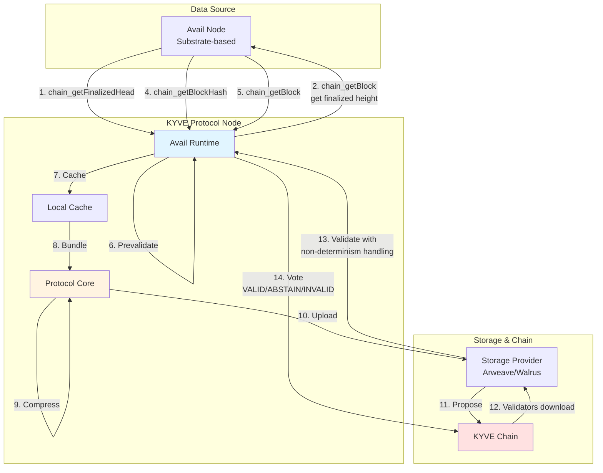
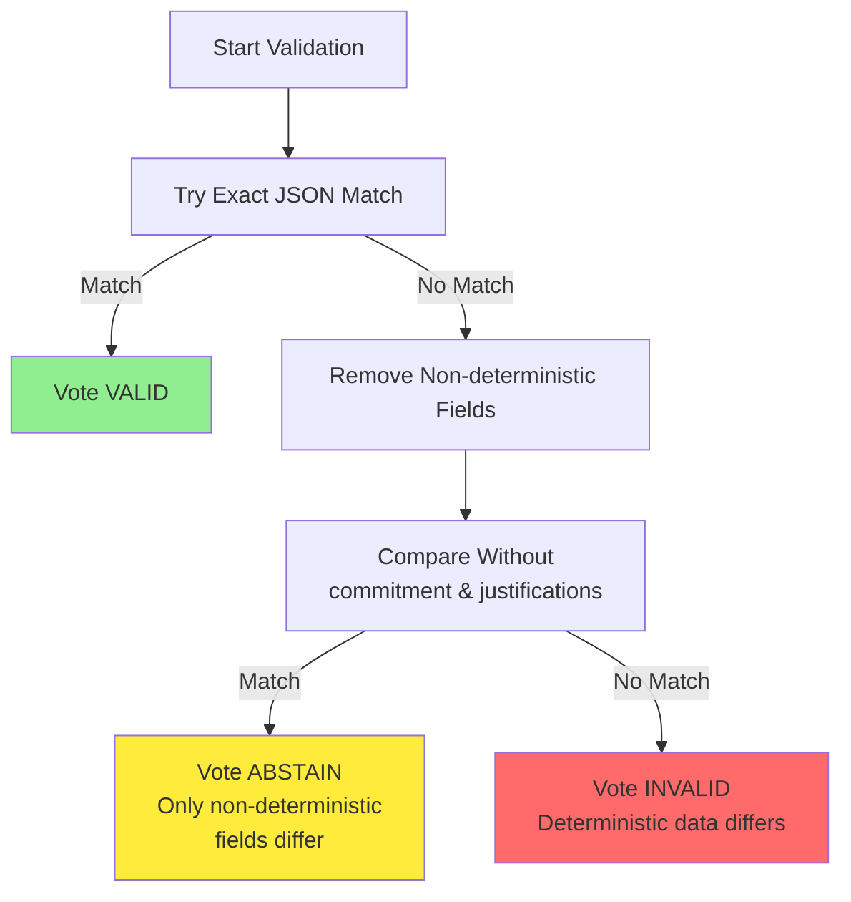

# @kyvejs/avail

## Content

- [Introduction](#introduction)
- [Use cases](#use-cases)
- [Architecture](#architecture)
  - [Data Collection Flow](#data-collection-flow)
  - [Finality Handling](#finality-handling)
  - [Non-deterministic Data Handling](#non-deterministic-data-handling)
  - [Runtime Implementation](#runtime-implementation)
- [Required Setup](#required-setup)
- [Integrations currently live](#integrations-currently-live)
  - [Mainnet](#mainnet)
  - [Testnet](#testnet)
  - [Devnet](#devnet)
- [Binary Installation](#binary-installation)
  - [Build from source](#build-from-source)
  - [Download prebuilt binary](#download-prebuilt-binary)
- [Run a node](#run-a-node)
- [Creating a pool with the runtime](#creating-a-pool-with-the-runtime)
  - [Config](#config)
  - [Environment Variable Override](#environment-variable-override)
  - [Create Pool governance proposal](#create-pool-governance-proposal)

## Introduction

This runtime validates and archives blocks from the Avail blockchain, a modular data availability layer optimized for scalable applications. It stores finalized blocks with their headers and makes them available to directly download from the storage provider, enabling trustless access to Avail's data availability proofs.

The runtime uses Avail's Substrate-based JSON-RPC interface to fetch finalized blocks and handles the unique aspects of Avail's block structure, including commitment schemes and justifications. It implements sophisticated non-determinism handling to ensure validators can reach consensus even when certain block fields vary between nodes.

## Use cases

Avail provides data availability guarantees for modular blockchains and rollups. This runtime enables:

1. **Historical DA Archive**: Permanently store Avail's data availability proofs on decentralized storage
2. **Rollup Data Retrieval**: Provide validated historical data for rollups and validiums using Avail for data availability
3. **Data Analytics**: Analyze data availability patterns, blob sizes, and usage trends across the network
4. **Chain Syncing**: Bootstrap new Avail nodes with validated historical blocks, accelerating initial synchronization
5. **Cross-chain Verification**: Enable other chains to verify historical Avail data for bridges and interoperability protocols
6. **Data Availability Proofs**: Maintain permanent, immutable records of data availability commitments

## Architecture

This section explains how Avail block data is collected, validated, and archived.

### Data Collection Flow



### Finality Handling

Avail uses finality gadgets (similar to GRANDPA in Substrate chains) to finalize blocks. The runtime implements finality-aware data collection:

1. **Query finalized head**: Calls `chain_getFinalizedHead` to get the latest finalized block hash
2. **Determine finalized height**: Retrieves the finalized block to extract its height
3. **Compare with requested key**: Only processes blocks at or below the finalized height
4. **Wait if not finalized**: Throws an error if the requested block height exceeds finalized height, causing the runtime to wait for the next round

This approach ensures that validators only archive and validate blocks that have reached finality, preventing issues with chain reorganizations.

### Non-deterministic Data Handling

Avail blocks contain certain fields that can vary between nodes, even for the same finalized block. The runtime implements a sophisticated validation strategy to handle this:

**Non-deterministic Fields:**
- `value.block.header.extension.V3.commitment` - KZG polynomial commitments (can vary due to regeneration)
- `value.justifications` - GRANDPA finality justifications (can differ between nodes)

**Validation Strategy:**



**Why ABSTAIN?**
- An ABSTAIN vote means "I cannot definitively determine if this bundle is valid or invalid"
- Used when only expected non-deterministic fields differ
- Prevents false INVALID votes that would incorrectly slash honest uploaders
- Allows consensus to be reached based on validators who can verify the deterministic data

This approach ensures validators don't incorrectly reject valid blocks due to expected non-determinism while still catching genuine data mismatches.

### Runtime Implementation

The runtime implements the `IRuntime` interface with the following flow:

#### 1. getDataItem
Fetches finalized block at a given height:
- Queries `chain_getFinalizedHead` to get the latest finalized block hash
- Retrieves finalized block to determine current finalized height
- Throws error if requested height exceeds finalized height (waits for finality)
- Gets block hash for requested height using `chain_getBlockHash`
- Retrieves full block data using `chain_getBlock`
- Returns block with its hash

#### 2. prevalidateDataItem
Always returns true - no prevalidation is needed for Avail blocks.

#### 3. transformDataItem
No transformation is applied. Data is passed through as-is since non-determinism is handled in the validation step.

#### 4. validateDataItem
Implements multi-stage validation with non-determinism handling:

**Stage 1 - Exact Match:**
- Performs exact JSON string comparison
- If match: Returns VALID

**Stage 2 - Non-determinism Handling:**
- Removes `value.block.header.extension.V3.commitment` from both items
- Removes `value.justifications` from both items
- Compares modified items
- If match after removal: Returns ABSTAIN (only non-deterministic fields differed)
- If still no match: Returns INVALID (deterministic data differs)

This sophisticated approach ensures:
- **VALID**: All data matches exactly (ideal case)
- **ABSTAIN**: Only expected non-deterministic fields differ (safe to abstain)
- **INVALID**: Deterministic data differs (genuine mismatch)

#### 5. summarizeDataBundle
Creates a merkle root from all data item hashes in the bundle. The merkle root serves as a compact cryptographic summary stored on-chain.

#### 6. nextKey
Simply increments the block height by 1 to get the next block number.

## Required Setup

This runtime requires:
- **Avail node** as the data source (archive node recommended)
- **KYVE protocol node** to run the runtime
- **Sufficient storage** for the protocol node cache

**Minimum hardware requirements:**
- **RAM**: 8GB+ recommended
- **Storage**: 100GB+ for cache (grows over time)
- **Network**: Stable connection to both Avail network and KYVE chain
- **CPU**: 4+ cores recommended for handling validation workload

**Avail Node Requirements:**
- Node must be fully synced to the network
- WebSocket RPC must be enabled (wss:// or ws://)
- Archive mode is recommended for reliable historical data access
- Node should maintain connection to Avail network for finality updates

## Integrations currently live

The following integrations are running on this runtime and are currently live.

### Mainnet

(To be announced)

### Testnet

(To be announced)

### Devnet

(To be announced)

## Binary Installation

This section explains how to install a protocol node with this runtime. This is only relevant for protocol node operators who want to run a node in a pool which has this runtime.

### Build from source

The first option to install the binary is to build it from source. For that you have to execute the following commands:

```bash
git clone git@github.com:KYVENetwork/kyvejs.git
cd kyvejs
```

If you want to build a specific version you can checkout the tag and continue from the version branch. If you want to build the latest version you can skip this step.

```bash
git checkout tags/@kyvejs/avail@x.x.x -b x.x.x
```

After you have cloned the project and have the desired version, the dependencies can be installed and the project built:

```bash
yarn install
yarn setup
```

Finally, you can build the runtime binaries.

**INFO**: During the binary build, log warnings can occur. You can safely ignore them.

```bash
cd integrations/avail
yarn build:binaries
```

You can verify the installation by printing the version:

```bash
./out/kyve-linux-x64 version
```

### Download prebuilt binary

The second option to install the binary is to download the prebuilt binary from the releases page.

You can find all releases and their binaries [here](https://github.com/KYVENetwork/kyvejs/releases?q=avail).

Make sure to select the binary for your platform. For example, to download version `1.0.0-beta.5` for Linux x64:

```bash
wget https://github.com/KYVENetwork/kyvejs/releases/download/@kyvejs/avail@1.0.0-beta.5/kyve-linux-x64.zip
unzip kyve-linux-x64.zip
chmod +x kyve-linux-x64
```

Verify the installation:

```bash
./kyve-linux-x64 version
```

## Run a node

### General Setup

To run a protocol node with this runtime:

1. **Run an Avail Node**: Ensure your Avail node is synced and maintaining finalization
   - The node must have its RPC endpoint accessible (WebSocket preferred)
   - Archive mode is recommended for reliable historical data access
   - Ensure the node is connected to the Avail network and receiving finality updates

2. **Configure RPC Endpoint**: Set the `KYVEJS_AVAIL_RPC` environment variable to override the pool's default RPC endpoint (optional)

3. **Start KYVE Protocol Node**: Use KYSOR (recommended) or run the binary directly

Example using environment override:

```bash
export KYVEJS_AVAIL_RPC="ws://localhost:9944"
./kysor start --valaccount my-avail-pool
```

**Tip**: For production deployments, use KYSOR to manage your protocol node. See the [KYSOR documentation](../../tools/kysor/README.md) for setup instructions.

### Running an Avail Node

To set up your own Avail node:

1. Follow the official Avail node documentation at [docs.availproject.org](https://docs.availproject.org/)
2. Ensure WebSocket RPC is enabled in your node configuration
3. Configure the node to run in archive mode (recommended):
   ```bash
   avail --pruning=archive --rpc-external --ws-external
   ```
4. Wait for the node to sync and begin receiving finality updates
5. Verify RPC access: `curl http://localhost:9933/health`

## Creating a pool with the runtime

### Config

The pool configuration defines how the runtime fetches and validates data. Here's the config format:

```json
{
  "rpc": "wss://avail-node.example.com:9944"
}
```

**Config Properties:**

- **`rpc`**: Avail node JSON-RPC/WebSocket endpoint URL
  - Supports both WebSocket (`wss://`, `ws://`) and HTTP (`https://`, `http://`)
  - WebSocket is recommended for better performance
  - Can be overridden with `KYVEJS_AVAIL_RPC` environment variable

**Example Configurations:**

WebSocket endpoint (recommended):
```json
{
  "rpc": "wss://mainnet.avail.tools:443"
}
```

HTTP endpoint:
```json
{
  "rpc": "https://mainnet.avail.tools:443"
}
```

Local node:
```json
{
  "rpc": "ws://127.0.0.1:9944"
}
```

### Environment Variable Override

You can override the pool's RPC endpoint using the `KYVEJS_AVAIL_RPC` environment variable. This is useful for:
- Using a local node instead of a remote endpoint
- Testing with different RPC providers
- Running multiple pools with different endpoints

```bash
export KYVEJS_AVAIL_RPC="ws://localhost:9944"
```

### Create Pool governance proposal

To create a new pool with this runtime, submit a governance proposal in this format:

```json
{
  "messages": [
    {
      "@type": "/kyve.pool.v1beta1.MsgCreatePool",
      "authority": "kyve10d07y265gmmuvt4z0w9aw880jnsr700jdv7nah",
      "name": "Avail Mainnet Blocks",
      "runtime": "@kyvejs/avail",
      "logo": "ar://your-logo-arweave-id",
      "config": "{\"rpc\":\"wss://mainnet.avail.tools:443\"}",
      "start_key": "1",
      "upload_interval": "120",
      "operating_cost": "1000000",
      "min_delegation": "1000000000",
      "max_bundle_size": "100",
      "version": "1.0.0-beta.5",
      "binaries": "{\"kyve-linux-arm64\":\"https://github.com/KYVENetwork/kyvejs/releases/download/@kyvejs/avail@1.0.0-beta.5/kyve-linux-arm64\",\"kyve-linux-x64\":\"https://github.com/KYVENetwork/kyvejs/releases/download/@kyvejs/avail@1.0.0-beta.5/kyve-linux-x64\",\"kyve-macos-arm64\":\"https://github.com/KYVENetwork/kyvejs/releases/download/@kyvejs/avail@1.0.0-beta.5/kyve-macos-arm64\",\"kyve-macos-x64\":\"https://github.com/KYVENetwork/kyvejs/releases/download/@kyvejs/avail@1.0.0-beta.5/kyve-macos-x64\"}",
      "storageProviderId": "1",
      "compressionId": "1"
    }
  ],
  "metadata": "ipfs://your-metadata-cid",
  "deposit": "10000000000ukyve",
  "title": "Create Avail Mainnet Pool",
  "summary": "This proposal creates a new pool for archiving Avail mainnet blocks using the @kyvejs/avail runtime."
}
```

**Key Parameters:**

- **`name`**: Display name for the pool
- **`runtime`**: Must be `@kyvejs/avail`
- **`config`**: JSON string with the runtime configuration (see Config section above)
- **`start_key`**: Starting block height (e.g., "1" for genesis)
- **`upload_interval`**: Seconds between bundle uploads (e.g., "120" for 2 minutes)
- **`max_bundle_size`**: Maximum number of blocks per bundle
- **`version`**: Runtime version (see [package.json](./package.json) or releases for current version)
- **`binaries`**: JSON string with URLs to prebuilt binaries for all platforms
- **`storageProviderId`**: Storage provider to use (1 = Arweave, check docs for others)
- **`compressionId`**: Compression algorithm (1 = Gzip)

## Understanding Avail's Data Structure

### Block Structure

Each data item contains:

```typescript
{
  key: "block_height",
  value: {
    block: {
      header: {
        parentHash: "0x...",
        number: "block_height",
        stateRoot: "0x...",
        extrinsicsRoot: "0x...",
        digest: { ... },
        extension: {
          V3: {
            commitment: { ... }, // Non-deterministic
            appLookup: { ... },
            ...
          }
        }
      },
      extrinsics: [...]
    },
    hash: "0x..."
  },
  justifications: [...] // Non-deterministic (may be absent)
}
```

### Non-deterministic Fields Explained

**Why are these fields non-deterministic?**

1. **`commitment`** (KZG Commitments):
   - Polynomial commitments for data availability
   - Can be regenerated differently on different nodes
   - Cryptographically equivalent but may have different representations
   - Safe to ignore during validation since they prove the same data

2. **`justifications`** (GRANDPA Justifications):
   - Finality signatures from GRANDPA consensus
   - Different nodes may receive different sets of justifications
   - All are valid as long as they prove finality
   - Not part of the canonical block data

The runtime's two-stage validation ensures these expected variations don't cause false INVALID votes while still catching genuine data corruption.

## Additional Resources

- [KYVE Protocol Documentation](https://docs.kyve.network/)
- [Avail Documentation](https://docs.availproject.org/)
- [KYSOR Setup Guide](../../tools/kysor/README.md)
- [Protocol Package Documentation](../../common/protocol/README.md)
- [Creating New Runtimes Guide](../../CONTRIBUTING.md#creating-new-runtimes)
