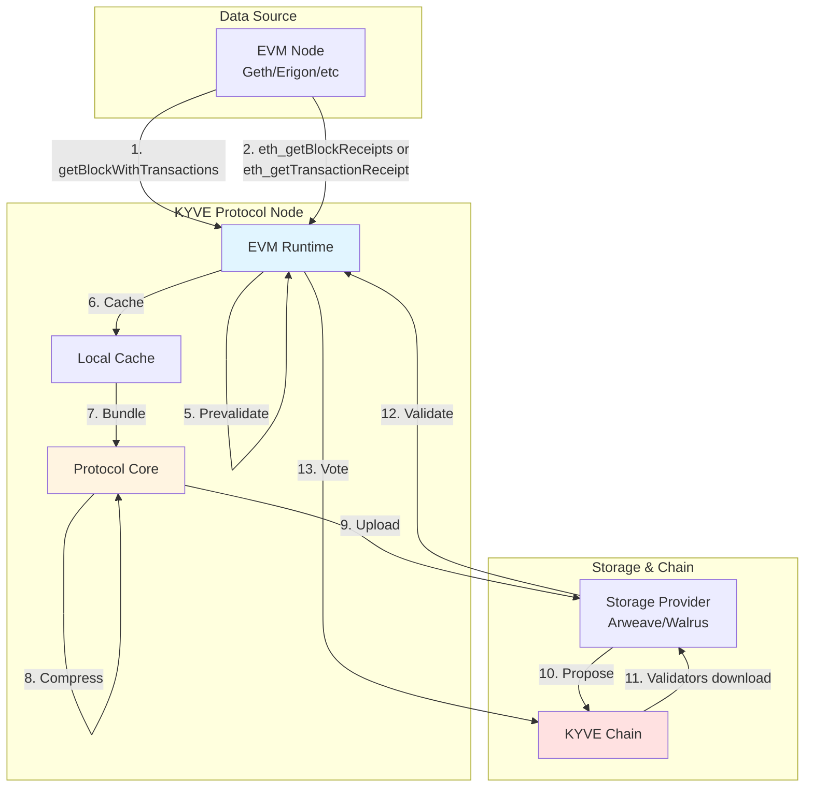

# @kyvejs/evm

## Content

- [Introduction](#introduction)
- [Use cases](#use-cases)
- [Architecture](#architecture)
  - [Data Collection Flow](#data-collection-flow)
  - [Runtime Implementation](#runtime-implementation)
- [Required Setup](#required-setup)
- [Integrations currently live](#integrations-currently-live)
  - [Mainnet](#mainnet)
  - [Testnet](#testnet)
  - [Devnet](#devnet)
- [Binary Installation](#binary-installation)
  - [Build from source](#build-from-source)
  - [Download prebuilt binary](#download-prebuilt-binary)
- [Run a node](#run-a-node)
- [Creating a pool with the runtime](#creating-a-pool-with-the-runtime)
  - [Config](#config)
  - [Environment Variable Override](#environment-variable-override)
  - [Create Pool governance proposal](#create-pool-governance-proposal)

## Introduction

This runtime validates and archives blocks and transaction data from any EVM-compatible blockchain. It stores block data including full transactions and receipts from a given height and makes them available to directly download from the storage provider. This enables trustless access to historical EVM chain data for applications like block explorers, analytics platforms, and blockchain indexers.

The runtime supports flexible data inclusion options, allowing pools to configure whether to include:
- Block data with full transaction details
- Block receipts (via `eth_getBlockReceipts` - efficient, single RPC call per block)
- Individual transaction receipts (via `eth_getTransactionReceipt` - one RPC call per transaction)

## Use cases

EVM-compatible chains generate vast amounts of transaction data that is expensive to store and query. This runtime enables:

1. **Historical Data Archive**: Permanently store EVM chain history on decentralized storage, making expensive archive nodes optional
2. **Block Explorer Infrastructure**: Provide validated data feeds for block explorers without running full archive nodes
3. **Data Analytics**: Enable ELT pipelines for on-chain analytics, allowing analysts to query historical data without blockchain infrastructure
4. **Chain Syncing**: Bootstrap new nodes with validated historical data, accelerating initial synchronization
5. **Cross-chain Applications**: Provide trustless historical data for bridges, oracles, and cross-chain protocols

## Architecture

This section explains how EVM block data is collected, validated, and archived.

### Data Collection Flow



### Runtime Implementation

The runtime implements the `IRuntime` interface with the following flow:

#### 1. getDataItem
Fetches block and receipts at a given height:
- Checks if finality has been reached (current height - finality blocks)
- Throws error if finality not reached (waits for next block)
- Retrieves block with full transactions using ethers.js
- Removes `confirmations` field from each transaction to ensure deterministic validation
- Fetches receipts based on config:
  - **blockReceipts**: Uses `eth_getBlockReceipts` (efficient, single RPC call)
  - **transactionReceipts**: Uses `eth_getTransactionReceipt` for each transaction (slower but compatible with all nodes)

#### 2. prevalidateDataItem
Validates that the data item value is not null. This catches basic issues before caching.

#### 3. transformDataItem
No transformation is applied. Data is passed through as-is since determinism is already ensured by removing the `confirmations` field.

#### 4. validateDataItem
Performs exact JSON string comparison between proposed and validation data items:
- **VALID**: If JSON strings match exactly
- **INVALID**: If any difference is detected

This deterministic approach ensures all validators reach the same conclusion.

#### 5. summarizeDataBundle
Creates a merkle root from all data item hashes in the bundle. The merkle root serves as a compact cryptographic summary stored on-chain.

#### 6. nextKey
Simply increments the block height by 1 to get the next block number.

## Required Setup

This runtime requires:
- **EVM-compatible node** (Geth, Erigon, or similar) as the data source
- **KYVE protocol node** to run the runtime
- **Sufficient storage** for the protocol node cache

The minimum hardware requirements depend on the specific EVM chain being archived. Generally:
- **RAM**: 8GB+ recommended
- **Storage**: 100GB+ for cache (grows over time)
- **Network**: Stable connection to both EVM node and KYVE chain

**Important**: Your EVM node must support either:
- `eth_getBlockReceipts` (recommended for efficiency), or
- `eth_getTransactionReceipt` (fallback for older nodes)

## Integrations currently live

The following integrations are running on this runtime and are currently live.

### Mainnet

(To be announced)

### Testnet

(To be announced)

### Devnet

(To be announced)

## Binary Installation

This section explains how to install a protocol node with this runtime. This is only relevant for protocol node operators who want to run a node in a pool which has this runtime.

### Build from source

The first option to install the binary is to build it from source. For that you have to execute the following commands:

```bash
git clone git@github.com:KYVENetwork/kyvejs.git
cd kyvejs
```

If you want to build a specific version you can checkout the tag and continue from the version branch. If you want to build the latest version you can skip this step.

```bash
git checkout tags/@kyvejs/evm@x.x.x -b x.x.x
```

After you have cloned the project and have the desired version, the dependencies can be installed and the project built:

```bash
yarn install
yarn setup
```

Finally, you can build the runtime binaries.

**INFO**: During the binary build, log warnings can occur. You can safely ignore them.

```bash
cd integrations/evm
yarn build:binaries
```

You can verify the installation by printing the version:

```bash
./out/kyve-linux-x64 version
```

### Download prebuilt binary

The second option to install the binary is to download the prebuilt binary from the releases page.

You can find all releases and their binaries [here](https://github.com/KYVENetwork/kyvejs/releases?q=evm).

Make sure to select the binary for your platform. For example, to download version `1.1.0-beta.20` for Linux x64:

```bash
wget https://github.com/KYVENetwork/kyvejs/releases/download/@kyvejs/evm@1.1.0-beta.20/kyve-linux-x64.zip
unzip kyve-linux-x64.zip
chmod +x kyve-linux-x64
```

Verify the installation:

```bash
./kyve-linux-x64 version
```

## Run a node

### General Setup

To run a protocol node with this runtime:

1. **Run an EVM Node**: Ensure your EVM node is synced to at least the pool's current height
   - The node must have its RPC endpoint accessible
   - Archive mode is recommended for reliable historical data access
   - Ensure the node supports `eth_getBlockReceipts` or `eth_getTransactionReceipt`

2. **Configure RPC Endpoint**: Set the `KYVEJS_EVM_RPC` environment variable to override the pool's default RPC endpoint (optional)

3. **Start KYVE Protocol Node**: Use KYSOR (recommended) or run the binary directly

Example using environment override:

```bash
export KYVEJS_EVM_RPC="http://localhost:8545"
./kysor start --valaccount my-evm-pool
```

**Tip**: For production deployments, use KYSOR to manage your protocol node. See the [KYSOR documentation](../../tools/kysor/README.md) for setup instructions.

## Creating a pool with the runtime

### Config

The pool configuration defines how the runtime fetches and validates data. Here's the config format:

```json
{
  "rpc": "https://eth-mainnet.example.com",
  "finality": 12,
  "includedData": {
    "blockWithTransactions": true,
    "blockReceipts": true,
    "transactionReceipts": false
  }
}
```

**Config Properties:**

- **`rpc`**: EVM JSON-RPC endpoint URL (can be overridden with `KYVEJS_EVM_RPC` environment variable)
- **`finality`**: Number of blocks to wait before considering data finalized (e.g., 12 for Ethereum mainnet)
- **`includedData`**: Object specifying what data to include in each data item
  - **`blockWithTransactions`**: Include full block data with transaction details
  - **`blockReceipts`**: Include all transaction receipts via `eth_getBlockReceipts` (efficient - single RPC call per block)
  - **`transactionReceipts`**: Include receipts via individual `eth_getTransactionReceipt` calls (fallback for nodes without `eth_getBlockReceipts`)

**Important Notes:**

- At least one data type must be included (you cannot set all to `false`)
- `blockReceipts` is recommended over `transactionReceipts` for efficiency
  - `blockReceipts`: 1 RPC call per block
  - `transactionReceipts`: N RPC calls per block (where N = number of transactions)
- Use `transactionReceipts` only if your EVM node doesn't support `eth_getBlockReceipts`

**Example Configurations:**

Full data with efficient receipts:
```json
{
  "rpc": "https://mainnet.example.com",
  "finality": 12,
  "includedData": {
    "blockWithTransactions": true,
    "blockReceipts": true,
    "transactionReceipts": false
  }
}
```

Blocks only (no receipts):
```json
{
  "rpc": "https://mainnet.example.com",
  "finality": 12,
  "includedData": {
    "blockWithTransactions": true,
    "blockReceipts": false,
    "transactionReceipts": false
  }
}
```

### Environment Variable Override

You can override the pool's RPC endpoint using the `KYVEJS_EVM_RPC` environment variable. This is useful for:
- Using a local node instead of a remote endpoint
- Testing with different RPC providers
- Running multiple pools with different endpoints

```bash
export KYVEJS_EVM_RPC="https://my-custom-evm-node:8545"
```

### Create Pool governance proposal

To create a new pool with this runtime, submit a governance proposal in this format:

```json
{
  "messages": [
    {
      "@type": "/kyve.pool.v1beta1.MsgCreatePool",
      "authority": "kyve10d07y265gmmuvt4z0w9aw880jnsr700jdv7nah",
      "name": "Ethereum Mainnet Blocks",
      "runtime": "@kyvejs/evm",
      "logo": "ar://your-logo-arweave-id",
      "config": "{\"rpc\":\"https://eth-mainnet.example.com\",\"finality\":12,\"includedData\":{\"blockWithTransactions\":true,\"blockReceipts\":true,\"transactionReceipts\":false}}",
      "start_key": "1",
      "upload_interval": "120",
      "operating_cost": "1000000",
      "min_delegation": "1000000000",
      "max_bundle_size": "100",
      "version": "1.1.0-beta.20",
      "binaries": "{\"kyve-linux-arm64\":\"https://github.com/KYVENetwork/kyvejs/releases/download/@kyvejs/evm@1.1.0-beta.20/kyve-linux-arm64\",\"kyve-linux-x64\":\"https://github.com/KYVENetwork/kyvejs/releases/download/@kyvejs/evm@1.1.0-beta.20/kyve-linux-x64\",\"kyve-macos-arm64\":\"https://github.com/KYVENetwork/kyvejs/releases/download/@kyvejs/evm@1.1.0-beta.20/kyve-macos-arm64\",\"kyve-macos-x64\":\"https://github.com/KYVENetwork/kyvejs/releases/download/@kyvejs/evm@1.1.0-beta.20/kyve-macos-x64\"}",
      "storageProviderId": "1",
      "compressionId": "1"
    }
  ],
  "metadata": "ipfs://your-metadata-cid",
  "deposit": "10000000000ukyve",
  "title": "Create Ethereum Mainnet Pool",
  "summary": "This proposal creates a new pool for archiving Ethereum mainnet blocks and receipts using the @kyvejs/evm runtime."
}
```

**Key Parameters:**

- **`name`**: Display name for the pool
- **`runtime`**: Must be `@kyvejs/evm`
- **`config`**: JSON string with the runtime configuration (see Config section above)
- **`start_key`**: Starting block height (e.g., "1" for genesis)
- **`upload_interval`**: Seconds between bundle uploads (e.g., "120" for 2 minutes)
- **`max_bundle_size`**: Maximum number of blocks per bundle
- **`version`**: Runtime version (see package.json or releases for current version)
- **`binaries`**: JSON string with URLs to prebuilt binaries for all platforms
- **`storageProviderId`**: Storage provider to use (1 = Arweave, check docs for others)
- **`compressionId`**: Compression algorithm (1 = Gzip)

## Additional Resources

- [KYVE Protocol Documentation](https://docs.kyve.network/)
- [EVM JSON-RPC Specification](https://ethereum.org/en/developers/docs/apis/json-rpc/)
- [KYSOR Setup Guide](../../tools/kysor/README.md)
- [Protocol Package Documentation](../../common/protocol/README.md)
- [Creating New Runtimes Guide](../../CONTRIBUTING.md#creating-new-runtimes)
