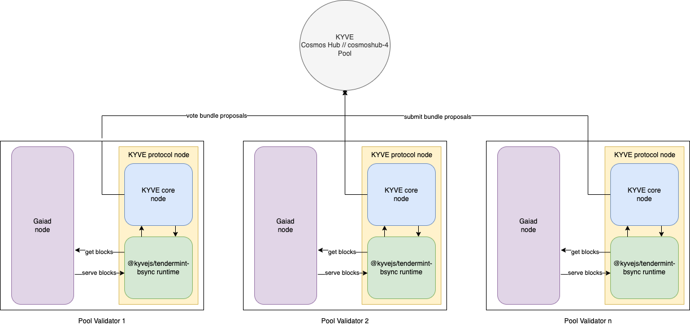

# @kyvejs/tendermint-bsync

## Content

- [Introduction](#introduction)
- [Use cases](#use-cases)
- [Integrations currently live](#integrations-currently-live)
  - [Mainnet](#mainnet)
  - [Testnet](#testnet)
  - [Devnet](#devnet)
- [Binary Installation](#binary-installation)
  - [Build from source](#build-from-source)
  - [Download prebuilt binary](#download-prebuilt-binary)
- [Run a node](#run-a-node)
  - [Cosmos Hub](#cosmos-hub)
    - [Requirements](#requirements)
    - [Step 1: Start gaia node](#step-1-start-gaia-node)
    - [Step 2: Start kyve node](#step-2-start-kyve-node)
- [Creating a pool with the runtime](#creating-a-pool-with-the-runtime)
  - [Config](#config)
  - [Create Pool governance proposal](#create-pool-governance-proposal)

## Introduction

This runtime validates and archives blocks from any tendermint based blockchain application. It only stores blocks from and to a given height and makes
them available to directly download them from the storage provider, or directly sync them into the blockchain nodes itself, therefore enabling block sync
via validated KYVE blocks.

## Use cases

Since storage pools which use this runtime archive validated and historical blocks blockchain nodes can use those archived blocks
to bootstrap themselves and sync to the current network height. This may make expensive archival nodes obsolete since those blocks are
already permanently and immutably archived. Additionally, block data can be retrieved over an ELT pipeline, further analyzing and using
it for different applications like block explorers.

## Required Setup

This runtime requires the node operator to run a tendermint node which is used as the source and the KYVE protocol node. Depending
on which tendermint chain gets archived the minimum hardware requirements are at least the min requirements of that tendermint node.

## Integrations currently live

The following integrations are running on this runtime and are currently live.

### Mainnet

(planned - currently in test)

### Testnet

- Pool ID: 0
  - Chain ID: _cosmoshub-4_
  - Base Height: _5200791_

### Devnet

- **Cosmos Hub // cosmoshub-4**
  - Pool ID: 24
  - Chain ID: _cosmoshub-4_
  - Base Height: _5200791_

## Binary Installation

This section explains how to install a protocol node with this runtime. This is only relevant for protocol node
operators who want to run a node in a pool which has this runtime.

### Build from source

The first option to install the binary is to build it from source. For that you have to execute the following
commands:

```bash
git clone git@github.com:KYVENetwork/kyvejs.git
cd kyvejs
```

If you want to build a specific version you can checkout the tag and continue from the version branch.
If you want to build the latest version you can skip this step.

```bash
git checkout tags/@kyvejs/tendermint-bsync@x.x.x -b x.x.x
```

After you have cloned the project and have the desired version the dependencies can be installed and the project build:

```bash
yarn install
yarn setup
```

Finally, you can build the runtime binaries.

**INFO**: During the binary build log warnings can occur. You can safely ignore them.

```bash
cd integrations/tendermint-bsync
yarn build:binaries
```

You can verify the installation with printing the version:

```bash
./out/kyve-linux-64 version
```

After the build succeeded you can find the binaries in the `out` folder where you can move them to use
desired location (like KYSOR).

### Download prebuilt binary

You can find all prebuilt binaries in the releases of the kyvejs repository. For this specific runtime they
can be found [here](https://github.com/KYVENetwork/kyvejs/releases?q=tendermint).

You can verify the installation with printing the version:

```bash
./kyve-linux-64 version
```

Once you have downloaded the binary for the correct platform and version you can simply unzip them and move them
to your desired location (like KYSOR).

## Run a node

This section explains which runtime specific setup you must have in order to run a node. This is only relevant for
protocol node operators who have already installed the binary (previous section) and want to run a node in a pool
which has this runtime.

Depending on the integration which are currently live the following setup has to be done.

### Cosmos Hub

**INFO**: This pool archives the current Cosmos Hub (Chain Id: cosmoshub-4) from block 5,200,791 to the current block (~14M).

Every protocol node runner will run their own Cosmos Hub blockchain node as a data source. This ensures
that the data which is getting proposed and validated actually comes from decentralized sources. Furthermore, since the gaia blockchain node only serves valid blocks we further increase the validation
of this data. With that setup a user who wants to join this pool first has to sync his gaia node to the current height the pool has already archived the blocks and then start the actual KYVE protocol node.

This architecture diagram summarizes the setup of the Cosmos Hub integration on KYVE:



Here this runtime is responsible for communicating with the tendermint application (purple) - in this case gaia, and forwarding the data to the KYVE core protocol. The KYVE core then handles the communication with the pool. This entire process (yellow) is the KYVE protocol node. The resulting
data are the blocks from the tendermint application - validated and permanently stored on a storage provider like Arweave.

#### Requirements

The following **minimum** hardware requirements have to be met:

- RAM: 16GB
- Storage: 512GB\*

\*This can increase over time

#### Step 1: Start gaia node

The first step is to start an archival gaia node. For that the gaia binary with the version `v4.2.1` has
to be installed. You can follow the official installation instructions [here](https://hub.cosmos.network/main/getting-started/installation.html) or download the binary directly from [here](https://github.com/cosmos/gaia/releases/tag/v4.2.1).

You can verify the successful installation with

```
./gaiad version
4.2.1
```

In order to setup the gaia config first choose a moniker and init gaia:

```bash
./gaiad init <your-moniker> --chain-id cosmoshub-4
```

To install the genesis file execute the following command:

```bash
wget https://raw.githubusercontent.com/cosmos/mainnet/master/genesis/genesis.cosmoshub-4.json.gz
gzip -d genesis.cosmoshub-4.json.gz
mv genesis.cosmoshub-4.json ~/.gaia/config/genesis.json
```

Peers can be added via this addrbook which can be retrieved here:

```bash
wget https://dl2.quicksync.io/json/addrbook.cosmos.json
mv addrbook.cosmos.json ~/.gaia/config/addrbook.json
chmod 666 ~/.gaia/config/addrbook.json
```

**TIP**: You can also add persistent_peers from Polkachu to ensure that you will actually find peers where you can sync with the network: https://polkachu.com/live_peers/cosmos

For pruning the following settings are recommended to decrease the disk usage:

~/.gaia/config/config.toml

```toml
[tx_index]

indexer = "null"
```

~/.gaia/config/app.toml

```toml
pruning = "everything"

index-events = [""]
```

Finally, the node can be started:

**NOTE**: For some users it might be required to increase the limit of open files on your system with `ulimit -n 65536`

**INFO**: Since the genesis file is quite big (over 100MB) the starting process can take a serveral minutes before the node starts to sync blocks.

```bash
./gaiad start --x-crisis-skip-assert-invariants
```

Now you have to sync blocks until the latest summary of the pool is reached. For example
if the latest pool summary is 6,000,000 you can check if the node has synced the blocks until
that height with:

```bash
curl http://localhost:26657/block?height=6000000
```

If it returns a valid block response you can continue with starting the actual KYVE protocol node
and start participating in the validation and archival process.

**TIP**: to save storage space you can start pruning blocks manually after they have been archived
by the pool since after that they are not needed anymore.

**TIP**: to make it easier during chain upgrades we also recommend running the chain with _cosmosvisor_. You can find official instructions [here](https://hub.cosmos.network/main/hub-tutorials/upgrade-node.html#cosmovisor)

#### Step 2: Start kyve node

The remaining installation of the KYVE protocol node is the same for every other protocol node. You can now follow the official docs starting from [here](https://docs.kyve.network/validators/protocol_nodes/requirements)

The Binaries of this runtime with which to join the pool can be found here: https://github.com/KYVENetwork/kyvejs/releases?q=tendermint-bsync

## Creating a pool with the runtime

This section explains how you can create a storage pool on KYVE with this specific runtime. This is only relevant for
users or projects, who are interested in archiving and validating a new data source.

### Config

This runtime requires the following config format in order to run:

```json
{
  "network": "CHAIN_ID_OF_INTEGRATION",
  "rpc": "https://rpc-endpoint-of-integration:26657"
}
```

Here the properties have the following reason:

- `network`: the chain ID of the network. This is a check to verify that only blocks from this network are validated and archived. The runtime rejects blocks that do not match with this ID
- `rpc`: the default rpc endpoint of the network to collect blocks from. This should only be a base URL **without** a trailing slash. This can be a public rpc endpoint from a dedicated provider or an URL pointing to localhost in order to signal that every protocol node has to host their own blockchain node

This config should then be stringified on the pool and should look like this:

```json
{
  "config": "{\"network\":\"CHAIN_ID_OF_INTEGRATION\",\"rpc\":\"https://rpc-endpoint-of-integration:26657\"}"
}
```

With this setup the runtime is able to run. Furthermore an optional environment variable can be set to override the default rpc endpoint (`rpc`).

```bash
export KYVEJS_TENDERMINT_BSYNC_RPC="https://my-custom-rpc-endpoint:26657"
```

### Create Pool governance proposal

In order to create a pool it has to go through the Governance process (more on that can be found [here](https://docs.kyve.network/token_holders/governance)). An example proposal with which a storage pool with this runtime could be created can be found below:

```json
{
  "messages": [
    {
      "@type": "/kyve.pool.v1beta1.MsgCreatePool",
      "authority": "kyve10d07y265gmmuvt4z0w9aw880jnsr700jdv7nah",
      "name": "<your pool name>",
      "runtime": "@kyvejs/tendermint-bsync",
      "logo": "ar://<your logo stored on arweave>",
      "config": "<your config like described above>",
      "start_key": "<the initial height of the tendermint chain>",
      "upload_interval": "120", // 120s is the recommended value
      "operating_cost": "<your base bundle reward>", // for example 1000000 if the base reward per bundle should be 1 $KYVE
      "min_delegation": "<your required min delegation", // for example 1000000000 if the pool should only run if more than 1000 $KYVE are bonded in this pool
      "max_bundle_size": "100", // 100 blocks per bundle is the recommended value
      "version": "<runtime version>", // the current version of this runtime
      "binaries": "{\"kyve-linux-arm64\":\"<linux-arm64 binary download URL>\",\"kyve-linux-x64\":\"<linux-x64 binary download URL>\",\"kyve-macos-x64\":\"<macos-x64 binary download URL>\"}", // download URLs of binaries for KYSOR
      "storageProviderId": "1", // Arweave is the recommended storage provider
      "compressionId": "1" // Gzip is the recommended bundle compression
    }
  ],
  "metadata": "<your ipfs metadata info>", // gov proposal metadata
  "deposit": "<your deposit>ukyve" // proposal deposit, check the required min deposit
}
```

Once your proposal is ready you can submit it to the network. Please follow the official governance process to increase
the chances of getting your proposal accepted.
