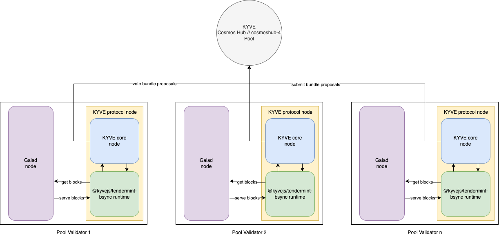

# @kyvejs/tendermint-bsync

## Introduction

This runtime validates and archives blocks from any tendermint based blockchain application. It only stores blocks from and to a given height and makes
them available to directly download them from the storage provider, or directly sync them into the blockchain nodes itself, therefore enabling block sync
via validated KYVE blocks.

## Use cases

Since storage pools which use this runtime archive validated and historical blocks blockchain nodes can use those archived blocks
to bootstrap themselves and sync to the current network height. This may make expensive archival nodes obsolete since those blocks are
already permanently and immutably archived. Additionally, block data can be retrieved over an ELT pipeline, further analyzing and using
it for different applications like block explorers.

## Integrations

The following integrations are running on this runtime and are currently live.

### Mainnet (KYVE)

(planned - currently in test)

### Testnet (Kaon)

(planned - currently in test)

### Devnet (Korellia)

- **Cosmos Hub // cosmoshub-4**
  - Pool ID: TBD
  - Chain ID: _cosmoshub-4_
  - Base Height: _5200791_
- **Axelar // axelar-dojo-1**
  - Pool ID: TBD
  - Chain ID: _axelar-dojo-1_
  - Base Height: _1_
- **Osmosis // osmosis-1**
  - Pool ID: TBD
  - Chain ID: _osmosis-1_
  - Base Height: _1_
- **Evmos // evmos_9001-2**
  - Pool ID: TBD
  - Chain ID: _evmos_9001-2_
  - Base Height: _58701_

## Config

This runtime requires the following config format in order to run:

```json
{
  "network": "CHAIN_ID_OF_INTEGRATION",
  "rpc": "https://rpc-endpoint-of-integration:26657"
}
```

Here the properties have the following reason:

- `network`: the chain ID of the network. This is a check to verify that only blocks from this network are validated and archived. The runtime rejects blocks that do not match with this ID
- `rpc`: the default rpc endpoint of the network to collect blocks from. This should only be a base URL **without** a trailing slash. This can be a public rpc endpoint from a dedicated provider or an URL pointing to localhost in order to signal that every protocol node has to host their own blockchain node

This config should then be stringified on the pool and should look like this:

```json
{
  "config": "{\"network\":\"CHAIN_ID_OF_INTEGRATION\",\"rpc\":\"https://rpc-endpoint-of-integration:26657\"}"
}
```

With this setup the runtime is able to run. Furthermore an optional environment variable can be set to override the default rpc endpoint (`rpc`).

```bash
export KYVEJS_TENDERMINT_BSYNC_RPC="https://my-custom-rpc-endpoint:26657"
```

## Join pools

The following Pools are currently live and can be joined

### Cosmos Hub // cosmoshub-4

Every protocol node runner will run their own Cosmos Hub blockchain node as a data source. This ensures
that the data which is getting proposed and validated actually comes from decentralized sources. Furthermore, since the gaia blockchain node only serves valid blocks we further increase the validation
of this data. With that setup a user who wants to join this pool first has to sync his gaia node to the current height the pool has already archived the blocks and then start the actual KYVE protocol node.

This architecture diagram summarizes the setup of the Cosmos Hub integration on KYVE:



Here this runtime is responsible for communicating with the tendermint application (purple) - in this case gaia, and forwarding the data to the KYVE core protocol. The KYVE core then handles the communication with the pool. This entire process (yellow) is the KYVE protocol node. The resulting
data are the blocks from the tendermint application - validated and permanently stored on a storage provider like Arweave.

#### Requirements

The following **minimum** hardware requirements have to be met:

- RAM: 8GB
- Storage: 512GB\*

\*This can increase over time

#### Step 1: Start gaia node

The first step is to start an archival gaia node. For that the gaia binary with the version `v4.2.1` has
to be installed. You can follow the official installation instructions [here](https://hub.cosmos.network/main/getting-started/installation.html) or download the binary directly from [here](https://github.com/cosmos/gaia/releases/tag/v4.2.1).

You can verify the successful installation with

```
./gaiad version
4.2.1
```

In order to setup the gaia config first choose a moniker and init gaia:

```bash
./gaiad init <your-moniker> --chain-id cosmoshub-4
```

To install the genesis file execute the following command:

```bash
wget https://raw.githubusercontent.com/cosmos/mainnet/master/genesis/genesis.cosmoshub-4.json.gz
gzip -d genesis.cosmoshub-4.json.gz
mv genesis.cosmoshub-4.json ~/.gaia/config/genesis.json
```

Peers can be added via this addrbook which can be retrieved here:

```bash
wget https://dl2.quicksync.io/json/addrbook.cosmos.json
mv addrbook.cosmos.json ~/.gaia/config/addrbook.json
chmod 666 ~/.gaia/config/addrbook.json
```

**TIP**: You can also add persistent_peers from Polkachu to ensure that you will actually find peers where you can sync with the network: https://polkachu.com/live_peers/cosmos

For pruning the following settings are recommended to decrease the disk usage:

~/.gaia/config/config.toml

```toml
[tx_index]

indexer = "null"
```

~/.gaia/config/app.toml

```toml
pruning = "everything"

index-events = [""]
```

Finally, the node can be started:

**NOTE**: For some users it might be required to increase the limit of open files on your system with `ulimit -n 65536`

**INFO**: Since the genesis file is quite big (over 100MB) the starting process can take a serveral minutes before the node starts to sync blocks.

```bash
./gaiad start --x-crisis-skip-assert-invariants
```

Now you have to sync blocks until the latest summary of the pool is reached. For example
if the latest pool summary is 6,000,000 you can check if the node has synced the blocks until
that height with:

```bash
curl http://localhost:26657/block?height=6000000
```

If it returns a valid block response you can continue with starting the actual KYVE protocol node
and start participating in the validation and archival process.

**TIP**: to save storage space you can start pruning blocks manually after they have been archived
by the pool since after that they are not needed anymore.

**TIP**: to make it easier during chain upgrades we also recommend running the chain with _cosmosvisor_. You can find official instructions [here](https://hub.cosmos.network/main/hub-tutorials/upgrade-node.html#cosmovisor)

#### Step 2: Start kyve node

The remaining installation of the KYVE protocol node is the same for every other protocol node. You can now follow the official docs starting from [here](https://docs.kyve.network/validators/protocol_nodes/requirements)

The Binaries of this runtime with which to join the pool can be found here: https://github.com/KYVENetwork/kyvejs/releases?q=tendermint-bsync
