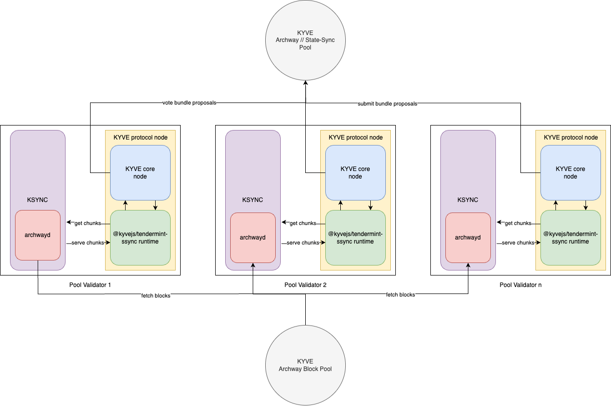

# @kyvejs/tendermint-ssync

## Content

- [Introduction](#introduction)
- [Use cases](#use-cases)
- [Binary Installation](#binary-installation)
  - [Build from source](#build-from-source)
  - [Download prebuilt binary](#download-prebuilt-binary)
- [Creating a pool with the runtime](#creating-a-pool-with-the-runtime)
  - [Config](#config)
  - [Create Pool governance proposal](#create-pool-governance-proposal)

## Introduction

This runtime validates and archives state-sync snapshots from any tendermint based blockchain application.
It only stores one snapshot chunk per bundle and makes the given snapshot chunks directly available for download
from the storage provider. This enabled the state- and height-sync feature for KSYNC.

## Use cases

Since storage pools which use this runtime archive validated and historical state-sync snapshots nodes can use those archived snapshots to state-sync to any historical height within minutes. This makes expensive and huge backups obsolete.

## Required Setup

This runtime requires the node operator to run a tendermint node which is used as the source and the KYVE protocol node. Depending
on which tendermint chain gets archived the minimum hardware requirements are at least the min requirements of that tendermint node.

This architecture diagram summarizes the setup of the Cosmos Hub integration on KYVE:



Here this runtime is responsible for communicating with the tendermint application (purple) - in this case gaia, and forwarding the data to the KYVE core protocol. The KYVE core then handles the communication with the pool. This entire process (yellow) is the KYVE protocol node. The resulting
data are the blocks from the tendermint application - validated and permanently stored on a storage provider like Arweave.

## Binary Installation

This section explains how to install a protocol node with this runtime. This is only relevant for protocol node
operators who want to run a node in a pool which has this runtime.

### Build from source

The first option to install the binary is to build it from source. For that you have to execute the following
commands:

```bash
git clone git@github.com:KYVENetwork/kyvejs.git
cd kyvejs
```

If you want to build a specific version you can checkout the tag and continue from the version branch.
If you want to build the latest version you can skip this step.

```bash
git checkout tags/@kyvejs/tendermint-ssync@x.x.x -b x.x.x
```

After you have cloned the project and have the desired version the dependencies can be installed and the project build:

```bash
yarn install
yarn setup
```

Finally, you can build the runtime binaries.

**INFO**: During the binary build log warnings can occur. You can safely ignore them.

```bash
cd integrations/tendermint-ssync
yarn build:binaries
```

You can verify the installation with printing the version:

```bash
./out/kyve-linux-64 version
```

After the build succeeded you can find the binaries in the `out` folder where you can move them to use
desired location (like KYSOR).

### Download prebuilt binary

You can find all prebuilt binaries in the releases of the kyvejs repository. For this specific runtime they
can be found [here](https://github.com/KYVENetwork/kyvejs/releases?q=tendermint).

You can verify the installation with printing the version:

```bash
./kyve-linux-64 version
```

Once you have downloaded the binary for the correct platform and version you can simply unzip them and move them
to your desired location (like KYSOR).

## Run a node

This section explains which runtime specific setup you must have in order to run a node. This is only relevant for
protocol node operators who have already installed the binary (previous section) and want to run a node in a pool
which has this runtime.

Depending on the integration which are currently live the following setup has to be done.

### Archway

The entire documentation on how to run a protocol node with the state-sync runtime can be found [here](https://docs.kyve.network/validators/protocol_nodes/pools/archway_state-sync/introduction)

## Creating a pool with the runtime

This section explains how you can create a storage pool on KYVE with this specific runtime. This is only relevant for
users or projects, who are interested in archiving and validating a new data source.

### Config

This runtime requires the following config format in order to run:

```json
{
  "api": "https://api-endpoint-ksync-snapshot-server:7878",
  "interval": "SNAPSHOT_INTERVAL"
}
```

Here the properties have the following reason:

- `api`: the api endpoint for retrieving the snapshot chunk data. This endpoint gets exposed by the KSYNC serve-snapshots command. The default port is 7878
- `interval`: the block interval at which snapshots should be created and archived. A smaller interval ensures quick height-syncs later, but takes more time due to archiving more snapshots over time

This config should then be stringified on the pool and should look like this:

```json
{
  "config": "{\"api\":\"http://localhost:7878\",\"interval\":3000}"
}
```

With this setup the runtime is able to run. Furthermore an optional environment variable can be set to override the default api endpoint (`api`).

```bash
export KYVEJS_TENDERMINT_SSYNC_API="https://my-custom-api-endpoint:7878"
```

### Create Pool governance proposal

In order to create a pool it has to go through the Governance process (more on that can be found [here](https://docs.kyve.network/token_holders/governance)). An example proposal with which a storage pool with this runtime could be created can be found below:

```json
{
  "messages": [
    {
      "@type": "/kyve.pool.v1beta1.MsgCreatePool",
      "authority": "kyve10d07y265gmmuvt4z0w9aw880jnsr700jdv7nah",
      "name": "<your pool name>",
      "runtime": "@kyvejs/tendermint-ssync",
      "logo": "ar://<your logo stored on arweave>",
      "config": "<your config like described above>",
      "start_key": "<interval>/0", // start key has to be a string with the following format. e.g. "3000/0" for the config above
      "upload_interval": "120", // 120s is the recommended value
      "operating_cost": "<your base bundle reward>", // for example 1000000 if the base reward per bundle should be 1 $KYVE
      "min_delegation": "<your required min delegation", // for example 1000000000 if the pool should only run if more than 1000 $KYVE are bonded in this pool
      "max_bundle_size": "1", // has to be 1!
      "version": "<runtime version>", // the current version of this runtime
      "binaries": "{\"kyve-linux-arm64\":\"<linux-arm64 binary download URL>\",\"kyve-linux-x64\":\"<linux-x64 binary download URL>\",\"kyve-macos-x64\":\"<macos-x64 binary download URL>\"}", // download URLs of binaries for KYSOR
      "storageProviderId": "2", // Bundlr is the recommended storage provider
      "compressionId": "1" // Gzip is the recommended bundle compression
    }
  ],
  "metadata": "<your ipfs metadata info>", // gov proposal metadata
  "deposit": "<your deposit>ukyve" // proposal deposit, check the required min deposit
}
```

Once your proposal is ready you can submit it to the network. Please follow the official governance process to increase
the chances of getting your proposal accepted.
